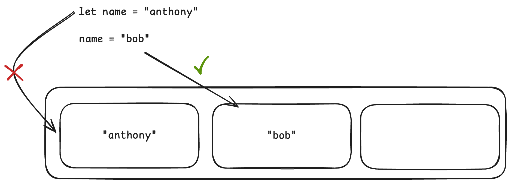
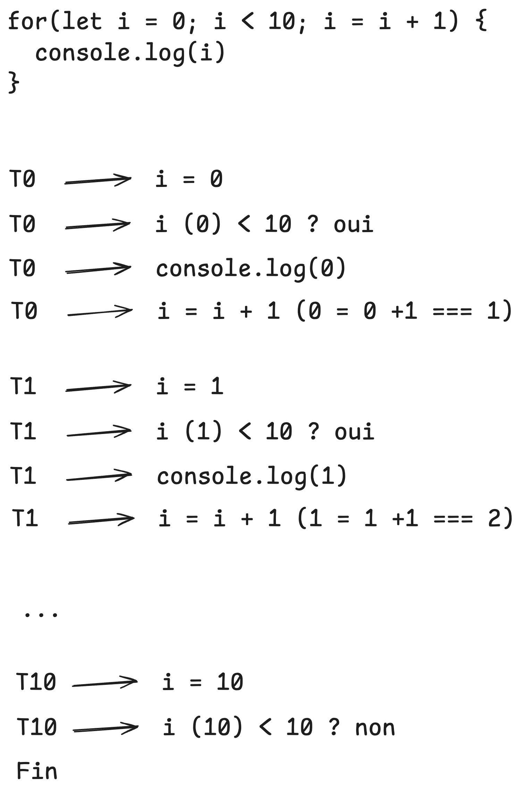
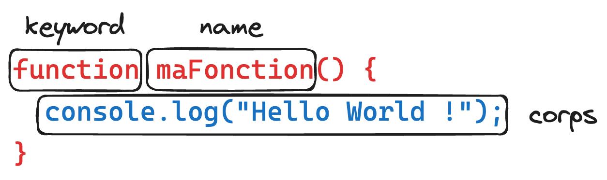
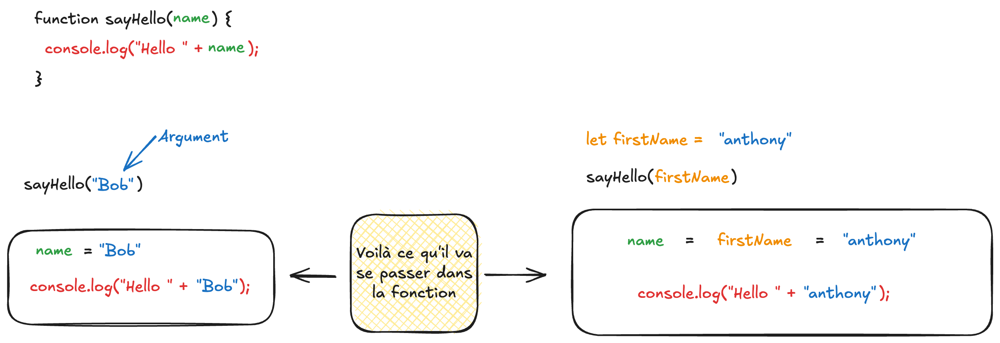

# Les bases de la programmation

## Sommaire

- [Les bases de la programmation](#les-bases-de-la-programmation)
  - [Sommaire](#sommaire)
    - [:calendar: 14/03/2025](#calendar-14032025)
      - [Les variables](#les-variables)
      - [Les types de données](#les-types-de-données)
      - [Les opérateurs](#les-opérateurs)
      - [Les tableaux](#les-tableaux)
      - [Les conditions](#les-conditions)
      - [Les boucles](#les-boucles)
      - [Les fonctions](#les-fonctions)
      - [🎁 Les 6 falsy values](#-les-6-falsy-values)

### :calendar: 14/03/2025

:package: _Récap du jour_

✨ _LES BASES PROGRAMMATIONS_ ✨


Alors, oui, c'est assez dur, il y a plein de choses à connaître, mais en vrai. Çaaa vaaaaa !

Tous ce que nous allons voir ici, sont à quelques exceptions près, valables pour tous les langages de programmation.

#### Les variables

Une variable est un espace mémoire qui permet de stocker une valeur.

```js
let maVariable = "Hello World !";
```

Attention, quand une variable est réassignée, elle perd sa valeur précédente.

```js
let prenom = "anthony";

prenom = "bob";
```

anthony est remplacé par bob.



#### Les types de données

Il existe plusieurs types de données :

Les **primitifs** :

-   `string` : chaîne de caractères
-   `number` : nombre
-   `boolean` : vrai ou faux
-   `null` : nul
-   `undefined` : non défini
-   ...

Les **non primitifs** :

-   `object` : objet
-   `array` : tableau
-   `function` : fonction
-   ...

#### Les opérateurs

Il y a les opérateurs mathématiques que vous connaissez déjà (`+`, `-`, `*`, `/`), mais il y en a d'autres.

-   `%` : modulo, le principe est de diviser un nombre par un autre et de récupérer le reste de la division.

Voilà le lien pour **TOUS** les opérateurs : [Expressions et opérateurs - JavaScript | MDN](https://developer.mozilla.org/fr/docs/Web/JavaScript/Guide/Expressions_and_operators)

#### Les tableaux

Les tableaux permettent de stocker plusieurs valeurs.

```js
let monTableau = [2, "Hello", true, ["coucou"]];
```

Il existent plusieurs méthodes pour manipuler les tableaux :

-   `push()` : ajoute un élément à la fin du tableau
-   `pop()` : supprime le dernier élément du tableau
-   `shift()` : supprime le premier élément du tableau
-   `unshift()` : ajoute un élément au début du tableau

Il est difficile de toutes les citer, mais voici un lien qui vous permettra de les découvrir : [Array - JavaScript | MDN](https://developer.mozilla.org/fr/docs/Web/JavaScript/Reference/Global_Objects/Array)

#### Les conditions

Les conditions permettent de faire des choix dans le code.

L'architecture d'un `if/else`:

```js
// Une condition doit obligatoirement se répondre par true ou false
if (condition) {
	// code
} else if (condition) {
	// code
} else {
	// code
}
```

Ex:

```js
let maVariable = "Bouh";

if (maVariable === "Hello World !") {
	console.log("C'est cool !");
} else {
	console.log("C'est pas cool !");
}
```

💡 Astuce !

Si votre condition est un booléen (`true` ou `false`), vous pouvez faire comme ça :

```js
let maVariable = true;

if (maVariable) {
	console.log("C'est cool !");
} else {
	console.log("C'est pas cool !");
}
```

Ou encore :

```js
// Avec le point d'exclamation, on inverse la valeur de la variable
if (!maVariable) {
	console.log("C'est pas cool !");
} else {
	console.log("C'est cool !");
}
```

#### Les boucles

Les boucles permettent de répéter une action.

Il y a **3 informations importantes** :

-   L'initialisation
-   La condition d'arrêt
-   L'incrémentation

`Boucle for`:

```js
// for (initialisation; condition; incrémentation){ code }
for (let i = 0; i < 10; i++) {
	console.log(i);
}
```



`Boucle while & do while`: (⚠️ attention à ne pas faire de boucle infinie !)

```js
// initialisation
let i = 0;

// while (condition d'arrêt) {
while (condition) {
	// code

	// incrémentation
	i++;
}
```

```js
// initialisation
let i = 0;

do {
	// code

	// incrémentation
	i++;
	// condition d'arrêt
} while (condition);
```

Il existe tout un tas d'autre façon de boucler, mais ce sont les plus courants.

#### Les fonctions

Les fonctions permettent de réutiliser du code encore et encore.

La syntaxe :



-   `function` : mot clé pour déclarer une fonction
-   `maFonction` : nom de la fonction
-   `()` : les paramètres
-   `{}` : le corps de la fonction

```js
function maFonction() {
	console.log("Hello World !");
}

/* réutilisation de la fonction maFonction */
maFonction();
maFonction();
```



⚠️ Attention, une fonction qui ne fait qu'un `console.log()` ne sert à rien !
Il faut que la fonction retourne (`return`) une valeur.

```js
function maFonction() {
	return "Hello World !";
}
```

Et pour récupérer la valeur de la fonction, je peux insérer ma fonction dans une variable :

```js
let maVariable = maFonction();
```

<details>
  <summary>Un exemple qui regroupe plein d'info 😎</summary>

```js
// ma variable students qui est un tableau d'étudiants
const students = [
	"Christophe",
	"Adrien",
	"Maxence",
	"Salahedine",
	"Jordan",
	"Jerome",
	"Damien",
	"Jules",
];

// une fonction sayHello qui prend 1 paramètre `name`
function sayHello(name) {
	console.log("Coucou " + name + " 👋");
}

// Une boucle for qui commence à 0 jusqu'à la taille du tableau
for (let i = 0; i < students.length; i += 1) {
	// utilisation de la fonction sayHello qui prend un argument
	// students[i] qui vaut le prénom de mon tableau "students" à l'index `i`
	sayHello(students[i]);
}
```

</details>

#### 🎁 Les 6 falsy values

Les 6 falsy values sont des valeurs qui sont évaluées à `false` dans une condition.

-   `false`
-   `0`
-   `""`
-   `null`
-   `undefined`
-   `NaN`

Si vous voulez en savoir plus, voici un article qui en parle : [Les 6 falsy values](https://developer.mozilla.org/fr/docs/Glossaire/Falsy)

:link: _Liens utiles_

-   [Programming Basics | Wild code school](https://wildcodeschool.github.io/workshop-programming-basics/)
